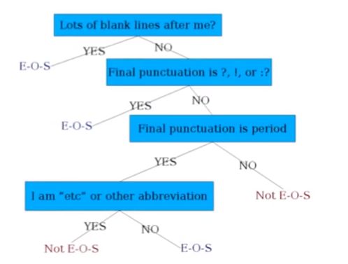

# Natural Language Processing

Class: MDS271

# What is Natural Language Processing?
In the broadest sense, we can say that natural processing is the *synthesising* and *processing* of human languages. NLP ranges from simple pattern making using regular expressions to deep neural nets trying to translate languages.

# Little History
NLP research started in the *1950* as a central part of artificial intelligence. There have had been made many seminal works in this field, but the accuracy and success was not achieved, because of the **ambiguity** in languages.

A good example prevalent at that time was --> *“The spirit is strong, but the flesh is weak” is incorrectly translated into
“The vodka is delicious, but the meat tastes bad.”*

From the late *1980* rule based methods were gradually replaced by machine learning and statistical methods which were proven to be much more successful. One of the example of statistical and ML method is as follows *if a verb is followed by a noun more frequently than a verb in data, then we put higher probability on “noun” when seeing an unknown or
ambiguous word after a verb.*

As a result there was a resurgence in NLP technologies. In NLP algorithms, the use of linguistic rules is transformed into the use of features, or linguistic patterns for which statistics are collected and used by machine learning models. 

From 2000's deep learning methods have overtaken theML and statistical based models. With growing time, the influence of lingusitic is weakening over NLP.

# Basic Text Processing

One of the most fundamental tools for text processing is, **Regular Expression**. A regular expression is a formal language for specifying text strings. 

To segment sentences, we can use **. ? !** etc. But, !, ? are relatively more ambiguous than a period,

Periods are relatively ambiguous because a period can be

- sentence boundary
- abbreviations like Dr.

- Number like 76.87

To segment a sentence we can build a binary classifier that will

- Look at "."
- Decides whether it is EndOfSentence/NotEndOfSentence
- Classifiers → handwritten rules, regex or through machine learning

A simple decision tree to predict EOS:

A more sophisticated decision tree:

1. Case of with "."
2. Case of the word after "."
3. Numeric Features
    - Length of word with "."
    - Probability(a word with"." occurs at EOS
    - Probability(word after "." occurs at beginning of a sentence) eg The

**Implementing Decision Tree**

A decision tree is just like if-then statements, the difficult part is to choose the features.

We can think of the questions in a decision tree as features that could be exploited by an classifier

- Logistic regression
- SVM
- Neural nets
- etc

## Tokenization

> I do uh main-mainly business data processing

words like *uh* are known as **filled pauses**

words like *main-mainly* are known as **fragments**

> Seuss's cat in the hat is different from other cats

**Lemma**: same stem, part of speech, rough word sense 

eg, cat and cats → same lemma

**wordform** → the full inflected surface form

eg cat and cats → different wordform

**Token**→ an instance of that type in running text

**Type**→ an element of the vocabulary

eg

> they lay back on the San Francisco grass and looked at the stars

→ 15 tokens(or 14)

→ 13 types (or 12) 

It depends on how we define our goal

$N$ = number of tokens

$V$ = vocabulary = set of types

$|V|$ is the size of the vocabulary

Issues in Tokenization →

Tokenization: Language issues →

## Byte Pair Encoding
Instead of white-space segmentation or single-character segmentation, we will use the data to tell us how to tokenize. **Subword tokenization** is a way in which the tokens can be part of words as well as whole words. 

Three common subword tokenization
1. Byte Pair Encoding (BPE)
2. Unigram language modeling tokenization
3. WordPiece

All these algorithms have two parts,
- a token *learner* that takes a raw training corpus and induces a vocabulary
- a token *segmenter* that takes a raw test sentence and tokenizes it according to that vocabulary. 

## Normalization
Word normalization is the task of putting words/tokens in a standard format, choosing a single normal form for words with multiple forms like USA and US or uh-huh and uhhuh.
1. We need to 'normalize' words
2. We implicitly define equivalence classes of terms
3. Alternative: asymmetric expansion
4. Potentially more powerful, but less efficient

### Case Folding
This means changing all the words to lower case. One problem can be in words like **US**, which is different to **us**.

### Lemmatization
Reduces inflections or variant forms to base form
- am, are, is -> be
- car, cars, car's, cars' -> cars
Lemmatization -> the correct dictionary headword

### Morphology
This deals with **morphemes** which are the small meaningful units and are of two types, *stems* and *affixes*. Stems are the core meaning bearing part, and affixes are bits and pieces that are related to stems and often, are grammatical functions. For example in the word **stems**, stem is the stems, and s is the affixes.

### Stemming
Reduce terms to their stem. Stemming is a **crude** way to chop off affixes. Its language dependant. For example automatic, automation to automat.

Two ways to do stemming are
1. Porters Algorithm
2. Lancaster Algorithm
3. Regex Method

Porters Algorithm:-

## Words and Corpora
To count the number of words in a given sentence, we need to take into account how exactly we are counting the word, are we counting the unique instances or all the tokens. 

 --> Number of tokens

 --> Vocabulary = set of types

 --> size of vocabulary

Heaps Law = Herdan's Law:

where often 

i.e. the vocabulary size grows with > square root of word of token

Some common corpus:

Corpora vary along dimension like
- Language --> 7097 languages in the world
- Variety --> like African American language varieties
- Code Switching --> switching from one language to another, like "No need to worry, abhi time hai"
- Genre --> newswire, scientific articles
- Authors demographics --> writers age, gender etc

## How similar are two similar words?

### Edit Distance

It can be found by their **Edit distance**. The minimum edit distance between two strings is the minimum number of editing operations that are needed to transform to one another. The editing operations are
1. Insertion
2. Deletion
3. Substitution

Algorithm for edit distance:

Performance:

# Language Modelling

# Latent Drichlet Allocation

In natural language processing, the term topic means a set of words that “go together”. These are the words that come to mind when thinking about a topic. For example while thinking of the words like athlete, soccer, and stadium, the topic "Sports" comes to mind. 

A topic model is one that automatically discovers topics occurring in a collection of documents

# Vector space models

# Neural Nets for NLP
Since texts can be seen as a sequence, hence neural networks like LSTM and RNN are used.

What do we need to handle in NLP: 
- Morphology
- Syntax
- Semantics/World Knowledge
- Discourse
- Pragmatics
- Multilinguality

In order to handle these, we can use Neural Networks. Neural networks are tools that can help us to handle hard things. 

# Research papers
1. Word2Vec

# Notebooks in this repository
1. [Topic Extraction and Classification using LDA and NB](https://github.com/ipshitag/Natural-Language-Processing/blob/main/Topic%20Extraction%20using%20LDA.ipynb)
2. [Spam Classification using Bernoulli NB](https://github.com/ipshitag/Natural-Language-Processing/blob/main/spam-classification-unbalanced-class-bernoullinb.ipynb) 

# Resources

1. [LDA Ktrain](https://nbviewer.jupyter.org/github/amaiya/ktrain/blob/master/examples/text/20newsgroups-topic_modeling.ipynb)
2. [LDA Topics](https://investigate.ai/text-analysis/choosing-the-right-number-of-topics-for-a-scikit-learn-topic-model/)
3. [LDA Hyper parameter](http://dirichlet.net/pdf/wallach09rethinking.pdf)
4. [LDA understanding](https://towardsdatascience.com/nlp-with-lda-latent-dirichlet-allocation-and-text-clustering-to-improve-classification-97688c23d98)
5. [LDA theory](https://en.wikipedia.org/wiki/Latent_Dirichlet_allocation)
6. [Text Preprocessing](https://www.youtube.com/watch?v=VyDmQggfsZ0)
7. [LDA Theory (vid) 1](https://www.youtube.com/watch?v=T05t-SqKArY)
8. [LDA Theory (vid) 2](https://www.youtube.com/watch?v=BaM1uiCpj_E)
